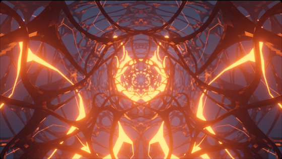

# ChronosClock
 This is a location-based clock that updates per JavaScript's internal clock system. The background videos were created by Aiden Romero using Blender.

 

## Blender Projects

1. **Cubes**: I started off with a cube and formed it into a rectangular prisma nd added the grooves at the top to give it some definition. For the rectangular prisms's animation all I did was make it traverse on the Y-Axis at different speeds. The light-emitting beams were made by making a texture with emission run from right to left while spinning on the X-Axis.

2. **Lights**: The Lights project that I created was a very simple but visually pleasing animation that I made using small circles with an emission effect and a bit of camera tweaking. For the animation I made the pattern change by changing the properties of the grid making a simple loop animation.

3. **Halloween Web**: This project was purposely made for Halloween because at the time of creating it, Halloween was just around the corner. The build was made with a variety of cylinders with a metallic material and the second cylinder was made with a larger amount of space in between the fractures of the cylinder and the material used was an orange emission material.

## Upcoming Features and TODO

1. Button to switch backgrounds

2. Downloadable ones that come from Cronos

3. You can add your own

4. You can change font, colors, etc.

5. Ctrl+H for Hiding Settings

6. Add a settings button

7. Create a logo for Cronos

## License

MIT License